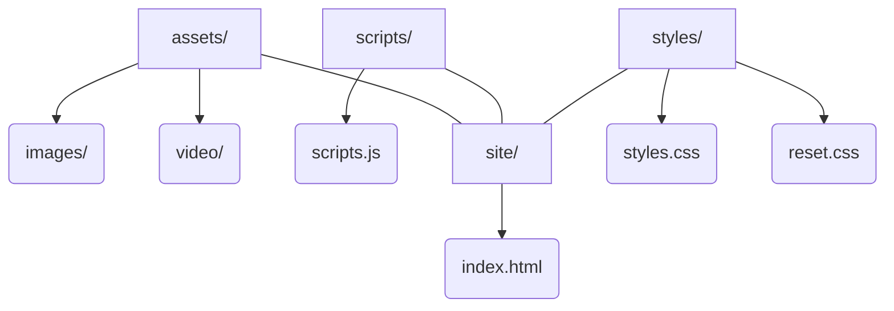
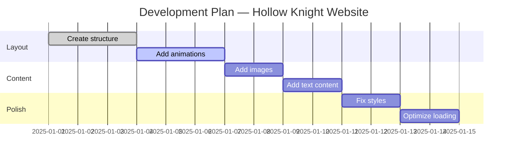

# Hollow Knight: Silksong — Website Clone

https://makslll-prog.github.io/Developing-site-Hollow-Khight/

This is a **fan-made recreation** of the official *Hollow Knight: Silksong* website, built for educational and portfolio purposes.  
It reproduces the visual style, layout, and mood of Team Cherry’s official design..

---

## 🌒 Features
- Faithful recreation of the section  
  **“Ascend to the Peak of a Haunted Kingdom”**
- Dark theme, elegant typography, and responsive grid
- Includes background trailer video (`assets/video/bg4.mp4`)
- Modular structure: HTML + CSS + JS separation
- Ready for deployment to GitHub Pages

---


## 🧭 Project Structure (Mermaid)



## 🗂️ Development Plan (Gantt)



## 🗂️ Project Structure


``` project-root/
│
├── assets/
│ ├── image/ # Site images (webp)
│ └── video/ # Background videos and trailer
│
├── scripts/
│ └── scripts.js # Main script file
│
├── site/
│ └── index.html # Section layout for Silksong copy
│
├── styles/
│ ├── reset.css # CSS reset
│ ├── styles.css # Main site styles
│ └── index.html # Preview / reference layout
│
├── LICENSE # License file
└── README.md # Documentation (this file)
```


---

## 🧠 Technologies
- **HTML5** – structure  
- **CSS3 (Flexbox + Grid)** – layout and responsiveness  
- **JavaScript (Vanilla)** – dynamic interactivity  

---

## 🛠️ Setup & Run

```bash
git clone https://github.com/yourusername/silksong-clone.git
cd silksong-clone
git checkout develop
start site/index.html.
```


``` Разработчики:
Барсков Максим - разработчик JS-части
Жуков Павел - тимлидер,  разработчик JS-части
Девляшкин Никита - разработчки HTML и дизайна сайта.


